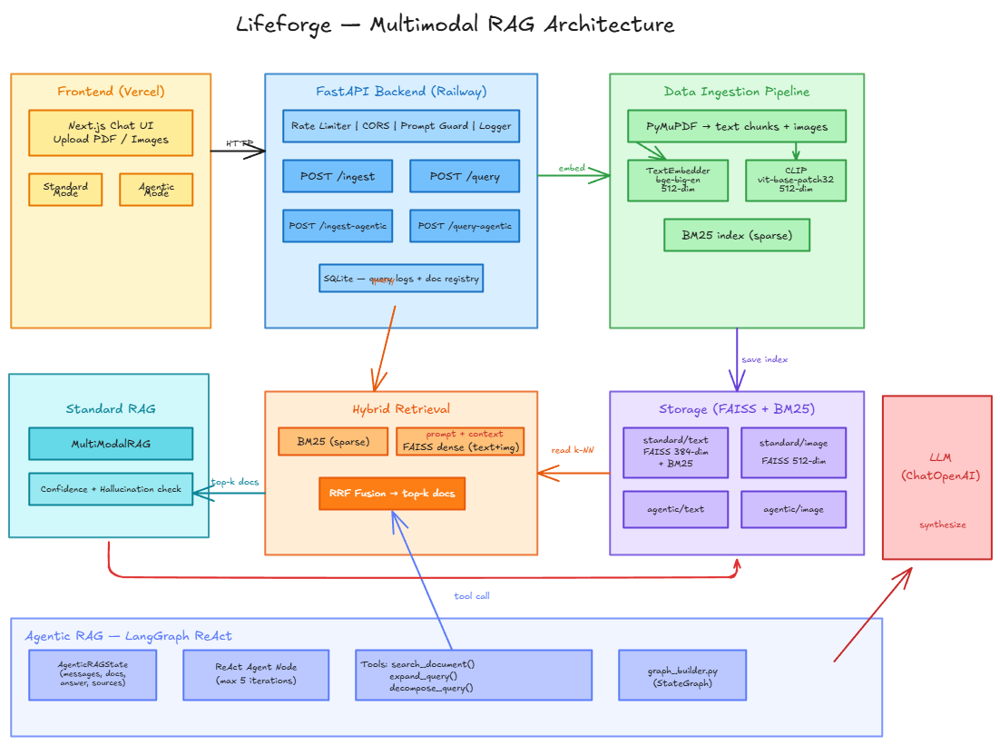

# Lifeforge

A multimodal RAG system. Upload a PDF — ask questions about it. Extracts text and images, embeds both with CLIP, and retrieves with a hybrid BM25 + dense vector search. A ReAct agent handles query planning and response generation.

**Live:** [omni-help.vercel.app](https://omni-help.vercel.app)
---

**Architecture**



## Stack

**Backend** — FastAPI · LangChain / LangGraph · FAISS · CLIP (openai/clip-vit-base-patch32) · BM25 · PyMuPDF · Python 3.11

**Frontend** — Next.js 15 · React 19 · TailwindCSS 4 · TypeScript

**Deployed on** Railway (backend) + Vercel (frontend)

---

## Running locally

### Quick start (both services)

```bash
bash start-dev.sh
```

Waits for the backend to be fully ready, then starts the frontend. Press `Ctrl+C` to stop both.

### Manual setup

**Backend**

```bash
cd services/backend
uv venv && source .venv/bin/activate  # Windows: .venv\Scripts\activate
uv pip install -r requirements.txt
uv pip install "torch==2.6.0+cpu" --index-url https://download.pytorch.org/whl/cpu
uvicorn app.api.app:app --reload --port 8000
```

Set `OPENAI_API_KEY` in your environment (or a `.env` file).

**Frontend**

```bash
cd services/frontend/multirag
npm install
NEXT_PUBLIC_API_URL=http://localhost:8000 npm run dev
```

Open [http://localhost:3000](http://localhost:3000).

---

## API

| Endpoint | Method | Description |
|---|---|---|
| `/ping` | GET | Health check |
| `/ingest-agentic` | POST | Upload a PDF (form-data `file`) |
| `/query-agentic-stream` | POST | Stream a response `{"question": "..."}` |
| `/ingest` | POST | Basic RAG ingest |
| `/query` | POST | Basic RAG query |

Interactive docs at `/docs` when running locally.

---

## Environment variables

| Variable | Required | Default | Description |
|---|---|---|---|
| `OPENAI_API_KEY` | Yes | — | OpenAI key for LLM and embeddings |
| `CORS_ORIGINS` | No | `http://localhost:3000` | Comma-separated allowed origins |
